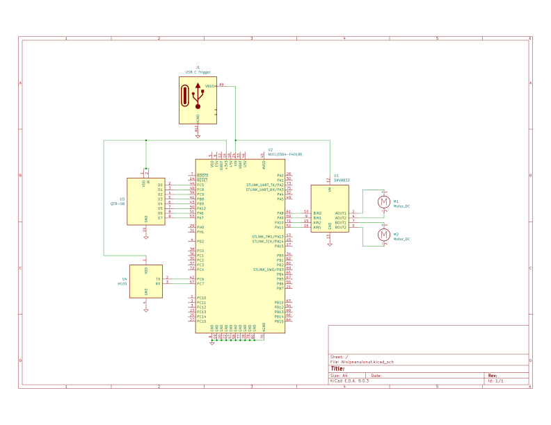
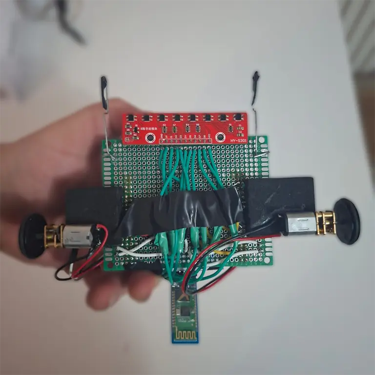
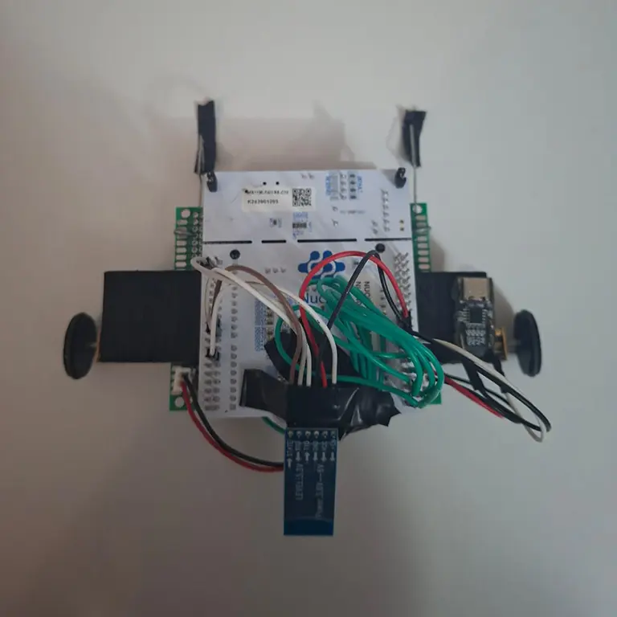

Version: FILS English

# LiRu - Line Follower In Rust

A line-following robot controlled by an STM32F401RE microcontroller running Rust firmware, with wireless control and telemetry via Bluetooth.

## info

Author: Nisipeanu Ionut 
GitHub Project Link: https://github.com/Nasapan23/LiRu

## Description

LiRu is an autonomous line-following robot that uses an 8-channel infrared sensor array to detect and follow lines on a surface. It's built on the STM32F401RE microcontroller (Nucleo F401RE development board) and runs embedded Rust code using the Embassy async framework. The system has two operational modes: manual remote control mode and autonomous line-following mode. Communication between the robot and a dashboard application is established via Bluetooth (HC-05 module), enabling real-time control, sensor monitoring, and telemetry visualization.

**Demo Video**: [Watch LiRu in action](https://youtube.com/shorts/ka_RuxrP6JE)

## Motivation

Since I was in primary school, I've been looking on the internet at building car-like robots, like line followers. I was fascinated by how these little machines could autonomously follow a line using sensors and smart algorithms. But I never had a chance to actually build one until now.

This project is finally my opportunity to make that childhood interest a reality. Building LiRu gave me the chance to work with embedded systems, learn Rust for microcontrollers, and actually implement the algorithms I had only read about before. It's been really satisfying to go from just reading about these robots online to having one that actually works and follows lines on the ground.

## Architecture

The LiRu system uses a three-tier architecture consisting of a web-based dashboard, a serial bridge service, and embedded robot firmware. These layers communicate through WebSocket (dashboard ↔ bridge) and serial protocols (bridge ↔ robot via Bluetooth).

### System Architecture Overview

The complete system architecture spans three distinct layers:

```
┌─────────────────────────────────────────────────────────────────┐
│                    Dashboard Layer (Web Browser)                │
│  React/TypeScript UI Components                                 │
│  - ControlPad, SensorDisplay, SpeedControl, StatusPanel        │
│  - WebSocket Client (ws://localhost:3001)                       │
└─────────────────────────────────────────────────────────────────┘
                              │
                              │ JSON over WebSocket
                              │
┌─────────────────────────────────────────────────────────────────┐
│                    Bridge Layer (Node.js)                         │
│  WebSocket Server + Serial Port Bridge                           │
│  - WebSocket Server (Port 3001)                                  │
│  - Serial Port Interface (COM Port)                               │
│  - Protocol Translation (JSON ↔ Binary)                          │
└─────────────────────────────────────────────────────────────────┘
                              │
                              │ Binary Serial (9600 baud)
                              │
┌─────────────────────────────────────────────────────────────────┐
│                    Robot Firmware Layer (STM32F401RE)            │
│  Rust/Embassy Embedded System                                    │
│  - Bluetooth Module (HC-05 via USART6)                          │
│  - Motor Controller (DRV8833 via TIM1 PWM)                     │
│  - Sensor Array (HY-S301 via ADC1)                              │
└─────────────────────────────────────────────────────────────────┘
```

### Layer 1: Dashboard Application

The dashboard is a React-based single-page application built with TypeScript and Vite, providing real-time robot control and telemetry visualization.

**Component Structure:**

- **App.tsx**: Main application component that orchestrates all UI components and manages application state
- **useRobotConnection.ts**: Custom React hook that encapsulates WebSocket communication logic, connection state management, and sensor data handling
- **ControlPad.tsx**: Interactive control pad component supporting keyboard input (W/A/S/D) and visual button controls for robot movement
- **SensorDisplay.tsx**: Visual sensor array display showing binary sensor state and raw ADC values as bar graphs
- **SpeedControl.tsx**: Speed adjustment slider for motor control in manual mode
- **StatusPanel.tsx**: Connection status indicator, calibration status, and debug log viewer

**Communication Flow:**

1. User interacts with dashboard UI (button clicks, keyboard input, sliders)
2. React components call functions from `useRobotConnection` hook
3. Hook sends JSON messages over WebSocket to bridge (`ws://localhost:3001`)
4. Hook receives JSON responses and updates React state
5. UI components re-render based on state changes

**Key Features:**

- Real-time sensor visualization with binary pattern and raw ADC values
- Dual mode support (Car mode for manual control, Line Follower mode for autonomous operation)
- Calibration status tracking and visualization
- Debug log viewer for telemetry data from robot
- Connection state management with automatic reconnection handling

### Layer 2: Serial Bridge Service

The bridge is a Node.js application that acts as a protocol translator between the web dashboard and the serial-connected Bluetooth module.

**Architecture:**

- **WebSocket Server**: Listens on port 3001 for dashboard connections
- **Serial Port Interface**: Connects to HC-05 Bluetooth module via COM port (Windows) or /dev/tty* (Linux/Mac)
- **Protocol Translation**: Converts JSON WebSocket messages to binary serial protocol and vice versa

**Communication Protocol:**

The bridge implements a binary protocol matching the robot firmware's `bluetooth.rs` module:

**Commands to Robot (Dashboard → Bridge → Robot):**
- `0x01 [left] [right]`: Set motor speeds (-100 to 100)
- `0x02`: Stop all motors
- `0x03`: Request binary sensor data
- `0x04`: Ping (connection check)
- `0x05`: Request raw sensor data (16-bit ADC values)
- `0x06 [mode]`: Set robot mode (0=Car, 1=Line Follower)
- `0x07`: Start calibration (Line Follower mode)

**Messages from Robot (Robot → Bridge → Dashboard):**
- `0x10 [byte]`: Binary sensor data (8-bit pattern)
- `0x11`: Pong response
- `0x12`: Robot connected notification
- `0x13 [16 bytes]`: Raw sensor data (8 × u16)
- `0x14 [mode] [position] [action]`: Debug message
- `0x15`: Calibration started
- `0x16`: Calibration ended
- `0x17 [8 bytes]`: Analog debug data (position, intensity, steering, speeds)
- `0xFF`: Error message

**Bridge Responsibilities:**

1. **Serial Port Management**: Opens/closes serial port connections based on dashboard requests
2. **WebSocket Client Management**: Handles multiple dashboard connections (single serial port shared)
3. **Data Parsing**: Parses binary serial data streams and reconstructs multi-byte messages
4. **Message Routing**: Routes commands from dashboard to serial port and responses back to dashboard
5. **Error Handling**: Manages connection errors, serial port disconnections, and protocol errors

### Layer 3: Robot Firmware

The robot firmware runs on the STM32F401RE microcontroller using Rust and the Embassy async runtime framework. The firmware implements a state machine that manages robot behavior across multiple operational modes.

**Firmware Module Architecture:**

The firmware is organized into three core modules plus the main control loop:

1. **motors.rs - Motor Control Module**
   - **Purpose**: Provides high-level motor control abstraction
   - **Hardware Interface**: TIM1 PWM timer with 4 channels (PA8-PA9-PA10-PA11)
   - **Features**:
     - Individual motor control (Left/Right)
     - Speed control via PWM duty cycle (0-100%)
     - Direction control (Forward/Reverse/Stop)
     - Differential drive support for turning
     - Power bank keep-alive mechanism (prevents power bank sleep)
   - **PWM Frequency**: 20kHz (inaudible to humans)
   - **Functions**: `set_motor()`, `set_both()`, `forward()`, `backward()`, `turn_left()`, `turn_right()`, `stop_all()`

2. **sensors.rs - Sensor Reading and Calibration Module**
   - **Purpose**: Manages 8-channel line sensor array with calibration support
   - **Hardware Interface**: ADC1 with 8 analog input channels
   - **Sensor Channels**: PA0, PA1, PA4, PB0, PC1, PC0, PC3, PC2
   - **Features**:
     - Raw ADC reading (0-4095 range)
     - Automatic calibration (min/max tracking)
     - Binary sensor output (threshold-based)
     - Weighted position calculation (center-of-mass algorithm)
     - Line intensity calculation for loss detection
   - **Calibration Process**:
     - Tracks minimum and maximum values per sensor
     - Calculates adaptive thresholds (40% from min toward max)
     - Normalizes readings to 0-1000 range
   - **Position Calculation**: Returns position (-3500 to +3500) and intensity (0-8000)
   - **Functions**: `read_all()`, `read_binary()`, `read_line_position()`, `update_calibration()`, `finalize_calibration()`

3. **bluetooth.rs - Communication Protocol Module**
   - **Purpose**: Handles bidirectional binary protocol communication
   - **Hardware Interface**: USART6 (PC6=TX, PC7=RX), PB6=STATE pin
   - **Features**:
     - Connection state detection (STATE pin monitoring)
     - Command parsing from dashboard
     - Message formatting for dashboard
     - Timeout-based non-blocking reads
     - Binary protocol matching bridge implementation
   - **Protocol**: Matches bridge/server.js protocol exactly
   - **Functions**: `try_read_command()`, `send_sensors()`, `send_raw_sensors()`, `send_analog_debug()`, `is_connected()`

4. **main.rs - Main Control Loop and State Machine**
   - **Purpose**: Orchestrates all modules and implements operational modes
   - **Runtime**: Embassy async executor with cooperative multitasking
   - **State Machine**: Four distinct operational modes
   - **Main Loop**: Async event loop with 10ms cycle time
   - **Tasks**: Spawns LED blink task for visual feedback

**Firmware Execution Flow:**

1. **Initialization Phase**:
   - Embassy runtime initialization
   - Peripheral configuration (GPIO, ADC, UART, TIM)
   - Module initialization (motors, sensors, bluetooth)
   - LED blink task spawn
   - Default mode: Car Mode

2. **Main Event Loop** (10ms cycle):
   - Check Bluetooth connection status
   - Process incoming commands (with timeout)
   - Execute mode-specific logic:
     - **Car Mode**: Manual control, debug sensor output
     - **LineFollowerIdle**: Wait for Start command
     - **LineFollowerCalibrating**: Sweep and calibrate (10 seconds)
     - **LineFollowerRunning**: Execute line-following algorithm
   - Send telemetry data (if in running mode)
   - 10ms delay to prevent tight loop

3. **Mode Transitions**:
   - Controlled by Bluetooth commands (SetMode, Start, Stop)
   - State changes trigger behavior changes
   - Calibration state managed separately

**Integration Points:**

- **Dashboard ↔ Bridge**: JSON messages over WebSocket
- **Bridge ↔ Robot**: Binary protocol over serial (9600 baud)
- **Robot Hardware**: Direct GPIO/PWM/ADC/UART access via Embassy HAL


### Line-Following Algorithm

The line-following algorithm implements a multi-zone proportional control system with automatic calibration. The algorithm operates in three phases:

#### Phase 1: Calibration (10 seconds)

During calibration, the robot performs two sub-phases:

1. **Sweeping Phase (0-8 seconds)**: The robot performs alternating left-right sweeping motions to expose all sensors to both white background and black line surfaces. During this phase, the algorithm continuously tracks the minimum and maximum ADC values for each of the 8 sensors.

2. **Active Centering Phase (8-10 seconds)**: Using the collected calibration data, the robot attempts to center itself on the line using simple proportional control. This ensures the robot starts the tracking phase in a favorable position.

After calibration completes, threshold values are calculated for each sensor as `threshold = min + 40% × (max - min)`, providing a hysteresis margin to prevent oscillation.

#### Phase 2: Weighted Position Calculation

The algorithm calculates the line position using a weighted center-of-mass calculation:

1. **Normalization**: Each sensor reading is normalized to a 0-1000 range based on its calibrated min/max values
2. **Weighted Sum**: The normalized values are multiplied by their sensor positions (0-7000, with 3500 as center) and summed
3. **Position**: The final position is calculated as `(weighted_sum / total_intensity) - 3500`, resulting in a range of -3500 (line on left/Index 0) to +3500 (line on right/Index 7), with 0 representing perfect center alignment
4. **Intensity**: The sum of normalized values provides a measure of line signal strength for line-loss detection

#### Phase 3: Multi-Zone Proportional Control

The control algorithm divides the position error into four zones, each with different control strategies:

1. **Center Zone (|position| < 500)**: 
   - High-speed operation (base speed: 90%)
   - Gentle proportional control (KP = 40)
   - Maintains high speed on straight segments
   - Speed range: 55-100% for each motor

2. **Warning Zone (500 ≤ |position| < 1500)**:
   - Medium-high speed (base speed: 75%)
   - Stronger proportional control (KP = 25)
   - Responds to line drift with moderate correction
   - Speed range: 40-100% for each motor

3. **Critical Zone (1500 ≤ |position| < 2500)**:
   - Fixed differential steering (35% speed difference)
   - Sharp turning response
   - Outer motor: 85%, inner motor: 30%
   - Designed for corners and sharp curves

4. **Emergency Zone (|position| ≥ 2500)**:
   - Near-pivot turn (maximum steering: 50%)
   - Extreme correction for severe misalignment
   - Outer motor: 95%, inner motor: 20%
   - Recovery mechanism for line loss at edges

#### Line Loss Recovery

When the line intensity drops below 500 (indicating line loss), the algorithm:

- Remembers the last turning direction (`last_direction`: -1=left, 0=center, +1=right)
- Performs aggressive pivot turn in the last known direction (outer motor: 90%, inner motor: 20%)
- If no previous direction is known, moves forward at 60% speed

This recovery strategy helps the robot reacquire the line quickly, especially after sharp turns or temporary line interruptions.

#### Algorithm Characteristics

- **Adaptive Calibration**: Automatically adjusts to different lighting conditions and surface materials
- **Smooth Control**: Multi-zone approach prevents oscillation and provides smooth transitions
- **High Performance**: Achieves high speeds (up to 90%) on straight segments while maintaining stability
- **Robust Recovery**: Effective line-loss detection and recovery mechanisms

## Log

### Week 5 - 11 May
Started with project planning and research. Developed preliminary schematic diagrams for the robot architecture. Did a literature review and consulted with hardware specialists to select appropriate components. Ordered all required hardware components including the microcontroller, motor drivers, sensor arrays, and communication modules. Initiated software development by setting up the base project structure and drafting initial algorithm specifications.

### Week 12 - 18 May
Hardware assembly and integration phase. Received all components and started the physical construction of the robot. Focused on proper circuit assembly, component interconnection, and soldering of electrical connections. This phase took the most time due to the learning curve with hardware fabrication techniques. Multiple iterations were necessary to get the wiring right and ensure proper electrical connections, but each iteration improved the circuit reliability and functionality.

### Week 19 - 25 May
Finished the hardware and completed the software implementation. Finalized the hardware assembly and then focused on software development and algorithm implementation. Conducted testing and validation in various environmental conditions. During testing, discovered an error in the sensor board wiring configuration, which required reworking the sensor connections. After fixing the wiring issue by resoldering, completed the system integration and final testing.

## Hardware

The robot is built using the following hardware components:

- **Nucleo F401RE**: STM32F401RE microcontroller development board serving as the main controller
- **DRV8833**: Dual H-bridge motor driver for controlling two DC motors independently
- **HY-S301**: 8-channel line tracking sensor module with infrared sensors arranged in a linear array
- **HC-05**: Bluetooth module for wireless communication with the dashboard application
- **Pololu micro DC motors**: Two small DC motors for robot locomotion

The sensors are connected to the microcontroller's ADC channels (PA0, PA1, PA4, PB0, PC1, PC0, PC3, PC2), while motor control uses TIM1 PWM channels (PA8, PA9, PA10, PA11). Bluetooth communication is handled via USART6 (PC6=TX, PC7=RX) with a state pin on PB6.

### Schematics







### Bill of Materials

| Device | Usage | Price |
|--------|-------|-------|
| Nucleo F401RE | The microcontroller development board | ~75 RON |
| DRV8833 | Dual H-bridge motor driver | ~7 RON |
| HY-S301 | 8-channel line tracking sensor module | ~1 RON |
| HC-05 | Bluetooth communication module | ~30 RON |
| Pololu micro DC motors (x2) | Robot locomotion motors | ~40 RON |
| Additional components (resistors, wires, chassis, etc.) | Construction and wiring | ~20 RON |

## Software

The firmware is written in Rust using the Embassy async runtime framework, which provides efficient cooperative multitasking for embedded systems. The codebase is organized into three main modules:

- **motors.rs**: Motor controller implementation using PWM timers for speed control
- **sensors.rs**: Line sensor interface with ADC reading and calibration logic
- **bluetooth.rs**: Bluetooth communication protocol handler with command parsing and message formatting

The main control loop implements a state machine with four modes: Car (manual control), LineFollowerIdle, LineFollowerCalibrating, and LineFollowerRunning. The line-following algorithm uses a multi-zone proportional control system that adjusts motor speeds based on the detected line position relative to the sensor array center.

The dashboard application is built with React and TypeScript, using Vite as the build tool and TailwindCSS for styling. It communicates with the robot via a serial bridge (Node.js) that interfaces with the Bluetooth connection.


### Bill of Materials

| Library | Description | Usage |
|---------|-------------|-------|
| embassy-executor | Embassy async runtime for embedded systems | Main executor for async tasks |
| embassy-time | Time management for Embassy | Timer and delay functionality |
| embassy-stm32 | STM32 HAL (Hardware Abstraction Layer) for Embassy | Hardware interface for STM32F401RE |
| cortex-m | Cortex-M processor support | Low-level processor operations |
| cortex-m-rt | Cortex-M runtime | Startup code and exception handling |
| defmt | Embedded logging framework | Debug logging and printf-style output |
| defmt-rtt | RTT (Real-Time Transfer) backend for defmt | Logging output via RTT |
| panic-probe | Panic handler for embedded Rust | Panic behavior and error reporting |
| embedded-hal | Hardware abstraction layer traits | Standard interfaces for embedded peripherals |
| react | React JavaScript library | Dashboard UI framework |
| react-dom | React DOM rendering | Dashboard DOM manipulation |
| typescript | TypeScript language | Type-safe JavaScript development |
| vite | Build tool and dev server | Fast development and build process |
| tailwindcss | Utility-first CSS framework | Dashboard styling |

## Links

### Hardware Documentation
- [STM32F401RE Microcontroller - STMicroelectronics](https://www.st.com/en/microcontrollers-microprocessors/stm32f401re.html)
- [Nucleo-F401RE Development Board - STMicroelectronics](https://www.st.com/en/evaluation-tools/nucleo-f401re.html)
- [DRV8833 Dual H-Bridge Motor Driver - Texas Instruments](https://www.ti.com/product/DRV8833)
- [HC-05 Bluetooth Module Documentation](https://components101.com/wireless/hc-05-bluetooth-module)
- [Pololu Micro Metal Gearmotors](https://www.pololu.com/category/60/micro-metal-gearmotors)
- ["Best Line Follower Robot Ever"](https://www.youtube.com/watch?v=RL-y_9GhcNg)
= ["HBFS Line Follower Turbo - Rooftop Edition"](https://www.youtube.com/watch?v=Shb_uZUFSzM)


### Software Libraries and Frameworks
- [Embassy - Embedded Async Runtime for Rust](https://embassy.dev/)
- [Embassy GitHub Repository](https://github.com/embassy-rs/embassy)
- [defmt - Efficient Logging Framework for Embedded Rust](https://defmt.ferrous-systems.com/)
- [React - JavaScript Library for Building User Interfaces](https://react.dev/)
- [TypeScript - Typed JavaScript](https://www.typescriptlang.org/)
- [Vite - Next Generation Frontend Tooling](https://vitejs.dev/)
- [Tailwind CSS - Utility-First CSS Framework](https://tailwindcss.com/)
- [Embedded Rust Book](https://docs.rust-embedded.org/book/)